# 🏗️ XAI-Tech Cybersecurity Platform - Architecture Documentation

## Overview

The XAI-Tech Cybersecurity Platform is a comprehensive, AI-powered security management system built with modern technologies. This document provides detailed architectural information, system design patterns, and implementation guidelines.

## System Architecture

### High-Level Architecture

```mermaid
graph TB
    subgraph "Client Layer"
        A[React Frontend] --> B[Shadcn/UI Components]
        A --> C[TanStack Query]
        A --> D[React Router]
        A --> E[Authentication Context]
    end

    subgraph "API Gateway Layer"
        F[NestJS API Gateway] --> G[Authentication Middleware]
        F --> H[Rate Limiting]
        F --> I[Request Validation]
        F --> J[CORS Configuration]
    end

    subgraph "Service Layer"
        K[Auth Service] --> L[JWT Management]
        K --> M[User Management]

        N[Incident Service] --> O[Incident CRUD]
        N --> P[Status Management]

        Q[Threat Service] --> R[Threat Intelligence]
        Q --> S[AI Analysis]

        T[Report Service] --> U[Report Generation]
        T --> V[Template Management]

        W[Search Service] --> X[Global Search]
        W --> Y[Index Management]
    end

    subgraph "Data Layer"
        Z[PostgreSQL Database] --> AA[Prisma ORM]
        Z --> BB[Data Migrations]
        Z --> CC[Connection Pooling]
    end

    subgraph "External Services"
        DD[AI/ML Services] --> EE[Threat Detection]
        DD --> FF[Anomaly Analysis]
        DD --> GG[Natural Language Processing]

        HH[Security Feeds] --> II[Threat Intelligence]
        HH --> JJ[Vulnerability Databases]
        HH --> KK[Malware Analysis]
    end

    A --> F
    F --> K
    F --> N
    F --> Q
    F --> T
    F --> W
    K --> Z
    N --> Z
    Q --> Z
    T --> Z
    W --> Z
    Q --> DD
    N --> HH
```

## Data Flow Architecture

### Authentication Flow

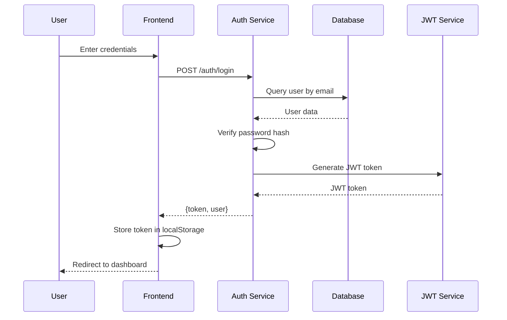

### Incident Management Flow

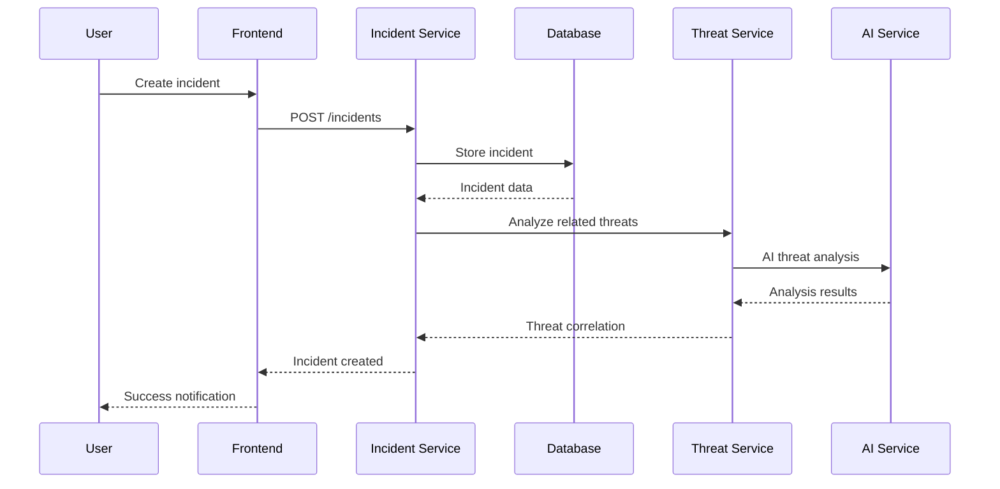

### Real-time Data Flow

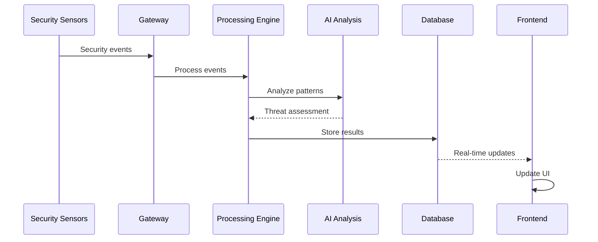

## Database Architecture

### Entity Relationship Diagram

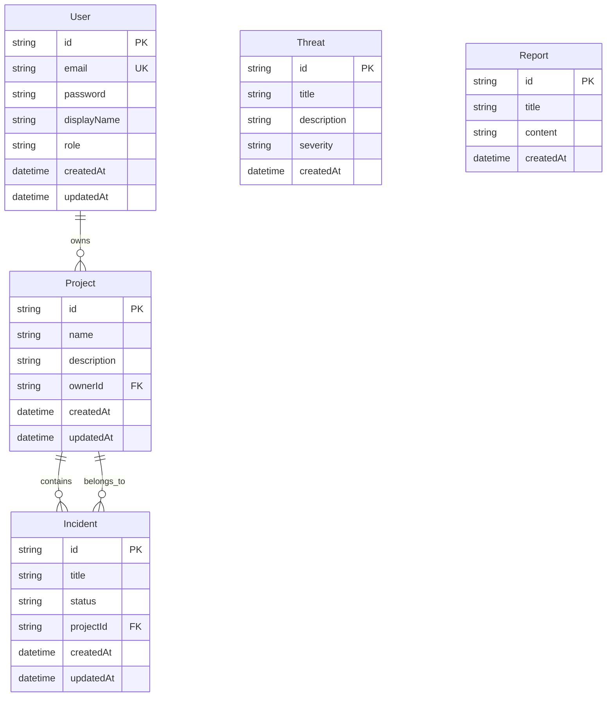

### Database Schema Details

#### Users Table

- **Purpose**: User authentication and authorization
- **Key Features**:
  - Email-based authentication
  - Role-based access control
  - Password hashing with bcrypt
  - Audit timestamps

#### Projects Table

- **Purpose**: Organize security incidents by project
- **Key Features**:
  - Project ownership
  - Incident grouping
  - Description and metadata

#### Incidents Table

- **Purpose**: Track security incidents
- **Key Features**:
  - Status management (open, investigating, resolved, closed)
  - Project association
  - Timestamp tracking

#### Threats Table

- **Purpose**: Store threat intelligence data
- **Key Features**:
  - Severity classification
  - Description and context
  - Creation timestamps

#### Reports Table

- **Purpose**: Generated security reports
- **Key Features**:
  - Report content storage
  - Generation timestamps
  - Template-based generation

## API Architecture

### RESTful API Design

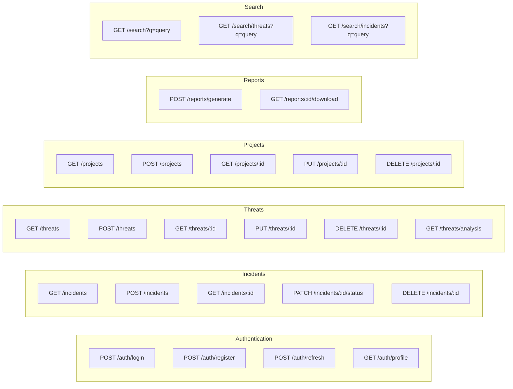

### API Response Format

```json
{
  "success": true,
  "data": {
    // Response data
  },
  "message": "Operation completed successfully",
  "timestamp": "2024-01-27T10:30:00Z"
}
```

### Error Handling

```json
{
  "success": false,
  "error": {
    "code": "VALIDATION_ERROR",
    "message": "Invalid input data",
    "details": [
      {
        "field": "email",
        "message": "Email is required"
      }
    ]
  },
  "timestamp": "2024-01-27T10:30:00Z"
}
```

## Frontend Architecture

### Component Hierarchy

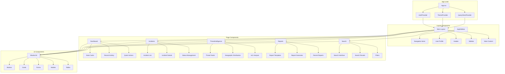

### State Management

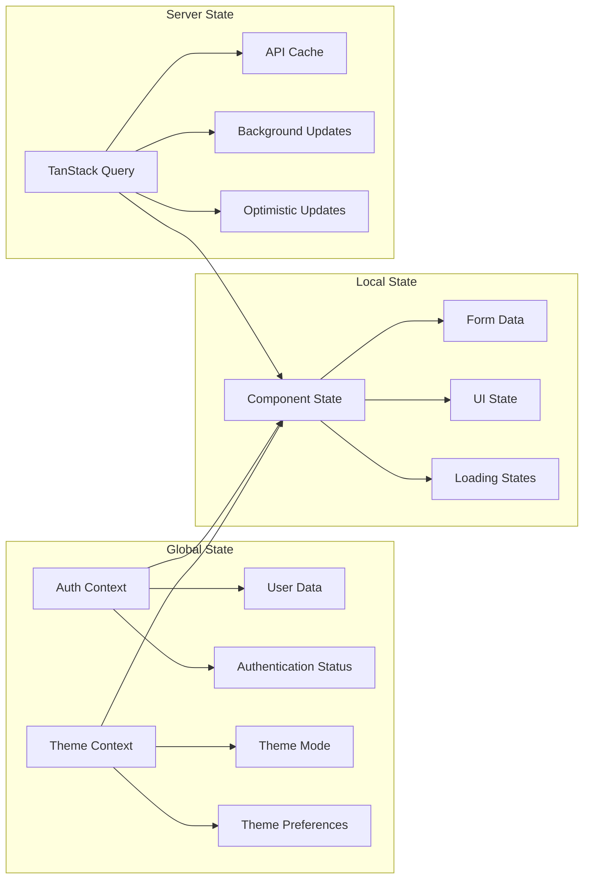

## Security Architecture

### Authentication & Authorization

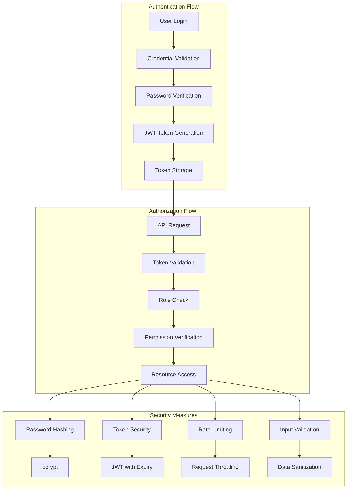

### Data Protection

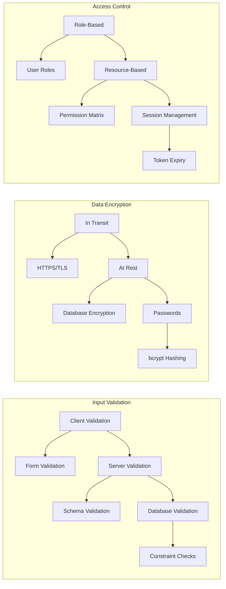

## Performance Architecture

### Caching Strategy

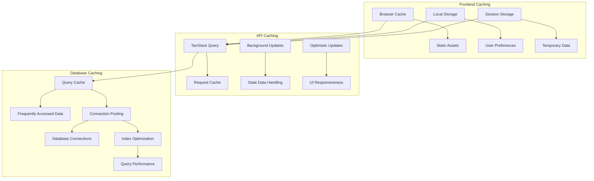

### Scalability Patterns

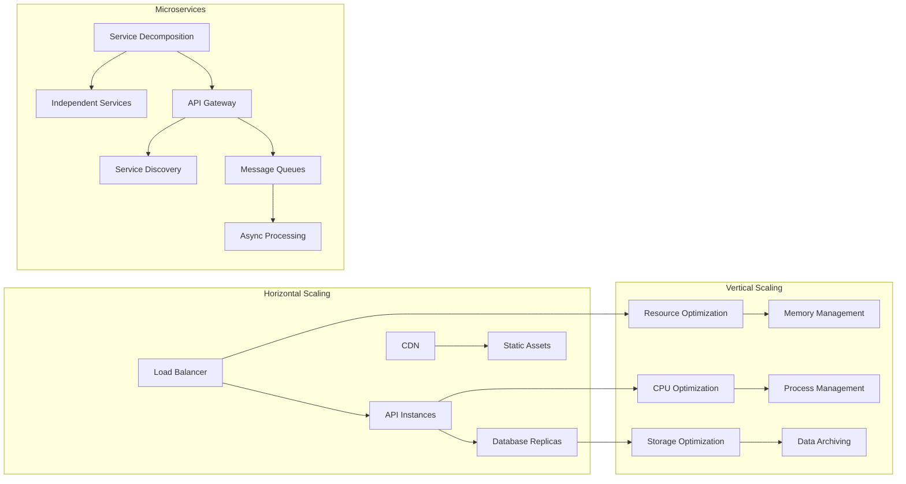

## Deployment Architecture

### Development Environment

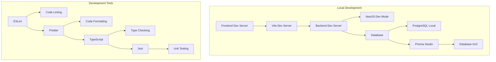

### Production Environment

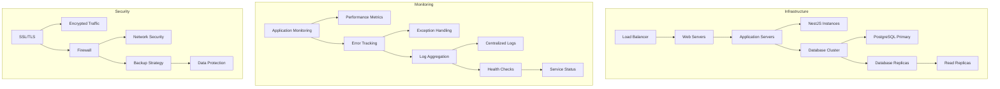

## AI Integration Architecture

### Machine Learning Pipeline

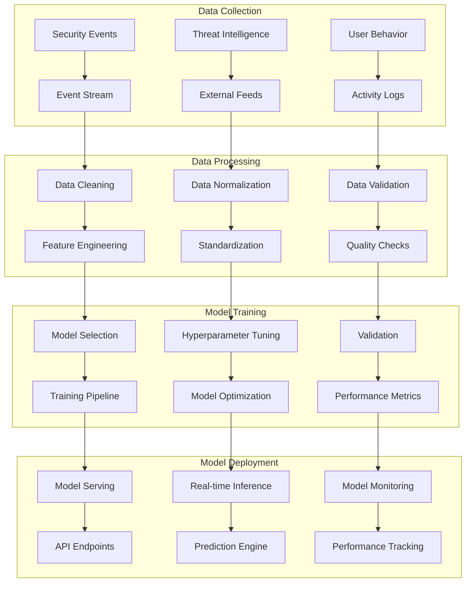

### AI Service Integration

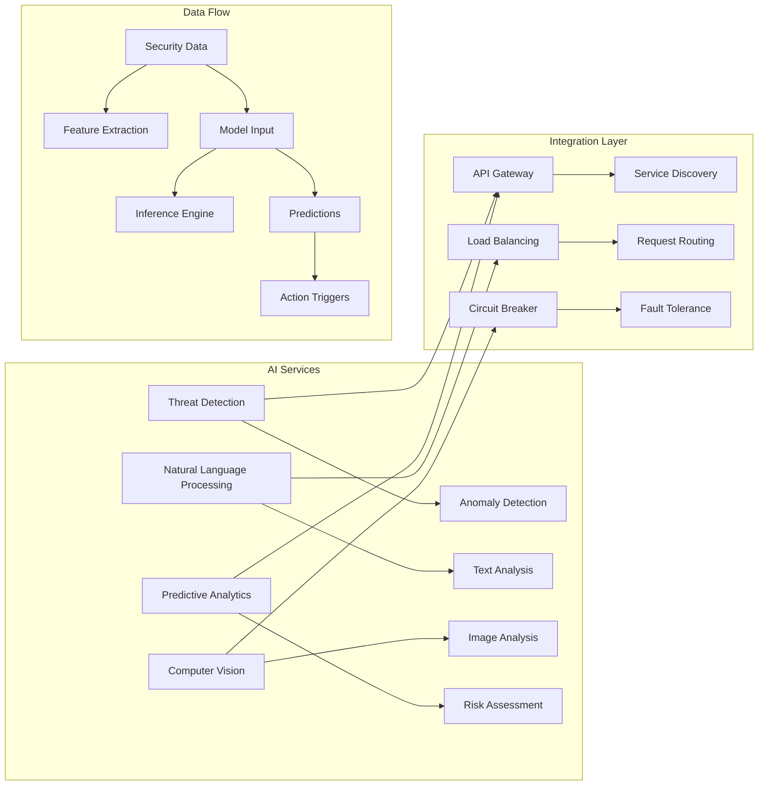

## Testing Architecture

### Testing Strategy

```mermaid
graph TB
    subgraph "Frontend Testing"
        A[Unit Tests] --> B[Component Testing]
        C[Integration Tests] --> D[Page Testing]
        E[E2E Tests] --> F[User Journey Testing]
        G[Visual Tests] --> H[UI Regression Testing]
    end

    subgraph "Backend Testing"
        I[Unit Tests] --> J[Service Testing]
        K[Integration Tests] --> L[API Testing]
        M[Database Tests] --> N[Data Layer Testing]
        O[Performance Tests] --> P[Load Testing]
    end

    subgraph "Test Infrastructure"
        Q[Test Environment] --> R[Isolated Database]
        S[Mock Services] --> T[External Dependencies]
        U[Test Data] --> V[Fixtures & Seeds]
    end

    B --> C
    D --> E
    F --> G
    J --> K
    L --> M
    N --> O
    R --> S
    T --> U
```

## Monitoring & Observability

### Monitoring Stack

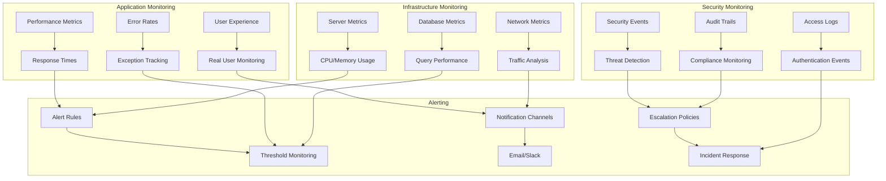

## Conclusion

This architecture provides a robust, scalable, and secure foundation for the XAI-Tech Cybersecurity Platform. The modular design allows for easy maintenance, testing, and future enhancements while ensuring high performance and reliability.

### Key Architectural Principles

1. **Separation of Concerns**: Clear boundaries between frontend, backend, and data layers
2. **Scalability**: Horizontal and vertical scaling capabilities
3. **Security**: Multi-layered security approach
4. **Performance**: Optimized caching and data access patterns
5. **Maintainability**: Clean code structure and comprehensive testing
6. **Observability**: Complete monitoring and logging infrastructure

### Future Enhancements

1. **Microservices Migration**: Decompose monolith into microservices
2. **Event-Driven Architecture**: Implement event sourcing and CQRS
3. **Advanced AI Integration**: Real-time ML model serving
4. **Multi-tenancy**: Support for multiple organizations
5. **Mobile Application**: Native mobile app development
6. **Advanced Analytics**: Business intelligence and reporting
