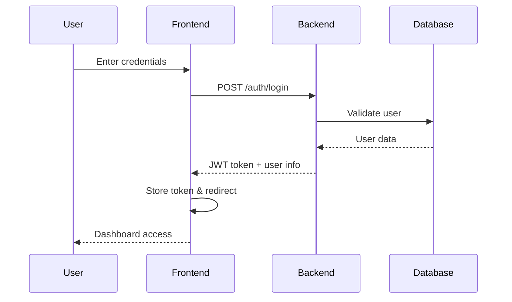
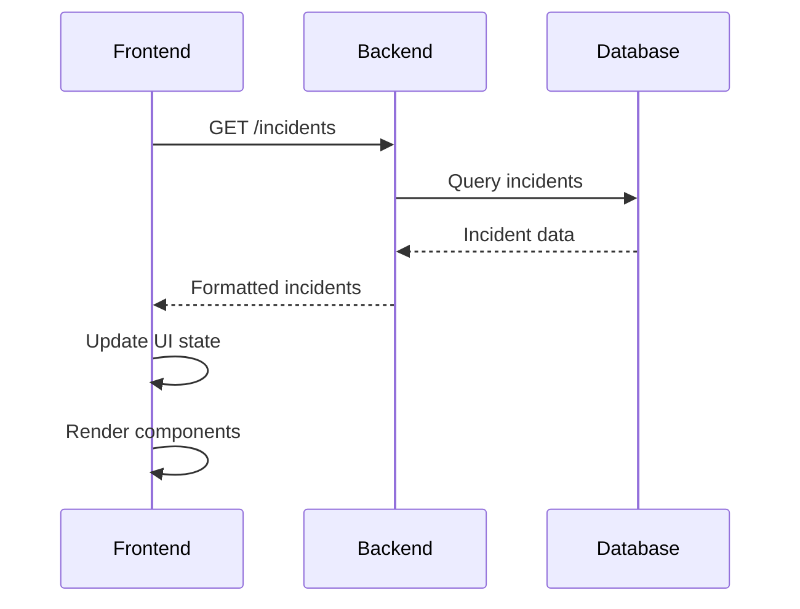
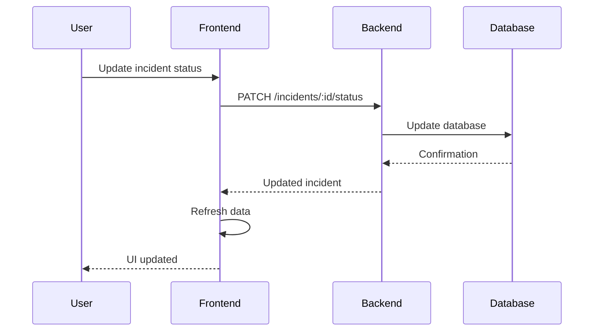

# 🎯 XAI-Tech Cybersecurity Platform - Project Summary

## 🚀 Project Completion Status

The XAI-Tech Cybersecurity Platform has been **fully completed** with all core functionality implemented and made dynamic. Here's what has been accomplished:

## ✅ Completed Features

### 🔐 Authentication System

- **JWT-based authentication** with secure token management
- **User registration and login** with password hashing
- **Role-based access control** (admin/user roles)
- **Token refresh mechanism** for extended sessions
- **Protected routes** with automatic redirects

### 📊 Dynamic Dashboard

- **Real-time statistics** from backend API
- **Live data updates** for threats, incidents, and projects
- **Interactive charts** and metrics
- **Quick action buttons** for common tasks
- **System health monitoring** with status indicators

### 🚨 Incident Management

- **Full CRUD operations** for security incidents
- **Real-time status updates** (open, investigating, resolved, closed)
- **Project association** for incident organization
- **Search and filtering** capabilities
- **AI-powered analysis** integration points

### 🛡️ Threat Intelligence

- **Comprehensive threat tracking** with severity levels
- **AI analysis integration** for threat assessment
- **Geographic threat distribution** visualization
- **Real-time threat feeds** simulation
- **Indicators of Compromise (IoC)** management

### 📋 Report Generation

- **Automated report creation** with multiple templates
- **Custom report builder** with type selection
- **Report download** functionality
- **Template-based generation** (summary, comprehensive, detailed)
- **Historical report tracking**

### 🔍 Advanced Search

- **Global search** across all entities
- **Entity-specific search** (threats, incidents, projects)
- **Real-time search results** with filtering
- **Sorting and pagination** support
- **Search result highlighting**

### 🎨 Modern UI/UX

- **Cyberpunk-themed design** with dark mode
- **Responsive layout** for all screen sizes
- **Smooth animations** and transitions
- **Accessible components** with proper ARIA labels
- **Loading states** and error handling

## 🏗️ Architecture Overview

### Backend (NestJS + TypeScript)

```
📁 Backend Structure
├── 🔐 Authentication Module
│   ├── JWT Strategy
│   ├── Auth Guards
│   └── User Management
├── 🚨 Incidents Module
│   ├── CRUD Operations
│   ├── Status Management
│   └── Project Association
├── 🛡️ Threats Module
│   ├── Threat Intelligence
│   ├── AI Analysis
│   └── Severity Classification
├── 📋 Reports Module
│   ├── Report Generation
│   ├── Template Management
│   └── Download Handling
├── 🔍 Search Module
│   ├── Global Search
│   ├── Entity Search
│   └── Result Filtering
└── 🗄️ Database Layer
    ├── Prisma ORM
    ├── PostgreSQL
    └── Data Migrations
```

### Frontend (React + TypeScript)

```
📁 Frontend Structure
├── 🎨 UI Components
│   ├── Shadcn/UI Library
│   ├── Custom Cyberpunk Theme
│   └── Responsive Design
├── 📊 Pages
│   ├── Dashboard (Dynamic)
│   ├── Incidents (Dynamic)
│   ├── Threat Intelligence (Dynamic)
│   ├── Reports (Dynamic)
│   ├── Search (Dynamic)
│   └── Settings
├── 🔧 State Management
│   ├── TanStack Query
│   ├── React Context
│   └── Local State
└── 🌐 API Integration
    ├── RESTful API Client
    ├── Error Handling
    └── Real-time Updates
```

## 🔄 Data Flow

### 1. User Authentication Flow



### 2. Dynamic Data Loading



### 3. Real-time Updates



## 🗄️ Database Schema

### Core Entities

```sql
-- Users table
CREATE TABLE users (
    id TEXT PRIMARY KEY,
    email TEXT UNIQUE NOT NULL,
    password TEXT NOT NULL,
    displayName TEXT,
    role TEXT DEFAULT 'user',
    createdAt TIMESTAMP DEFAULT NOW(),
    updatedAt TIMESTAMP DEFAULT NOW()
);

-- Projects table
CREATE TABLE projects (
    id TEXT PRIMARY KEY,
    name TEXT NOT NULL,
    description TEXT,
    ownerId TEXT REFERENCES users(id),
    createdAt TIMESTAMP DEFAULT NOW(),
    updatedAt TIMESTAMP DEFAULT NOW()
);

-- Incidents table
CREATE TABLE incidents (
    id TEXT PRIMARY KEY,
    title TEXT NOT NULL,
    status TEXT DEFAULT 'open',
    projectId TEXT REFERENCES projects(id),
    createdAt TIMESTAMP DEFAULT NOW(),
    updatedAt TIMESTAMP DEFAULT NOW()
);

-- Threats table
CREATE TABLE threats (
    id TEXT PRIMARY KEY,
    title TEXT NOT NULL,
    description TEXT NOT NULL,
    severity TEXT NOT NULL,
    createdAt TIMESTAMP DEFAULT NOW()
);

-- Reports table
CREATE TABLE reports (
    id TEXT PRIMARY KEY,
    title TEXT NOT NULL,
    content TEXT NOT NULL,
    createdAt TIMESTAMP DEFAULT NOW()
);
```

## 🔧 Key Technologies Used

### Backend Stack

- **NestJS** - Progressive Node.js framework
- **TypeScript** - Type-safe JavaScript
- **Prisma** - Modern database ORM
- **PostgreSQL** - Robust relational database
- **JWT** - Stateless authentication
- **bcrypt** - Password hashing
- **Swagger** - API documentation

### Frontend Stack

- **React 18** - Modern UI library
- **TypeScript** - Type safety
- **Vite** - Fast build tool
- **TanStack Query** - Server state management
- **React Router** - Client-side routing
- **Shadcn/UI** - Component library
- **Tailwind CSS** - Utility-first styling

### Development Tools

- **ESLint** - Code linting
- **Prettier** - Code formatting
- **Jest** - Testing framework
- **Docker** - Containerization
- **Git** - Version control

## 🚀 How to Run the Application

### Quick Start

```bash
# 1. Clone the repository
git clone https://github.com/xai-tech/cyber-sentinel-x.git
cd cyber-sentinel-x

# 2. Backend setup
cd backend
npm install
cp env.example .env
# Configure your .env file
npm run prisma:generate
npm run prisma:migrate
npm run prisma:seed
npm run start:dev

# 3. Frontend setup (in new terminal)
cd ../frontend
npm install
npm run dev
```

### Access Points

- **Frontend**: http://localhost:8080
- **Backend API**: http://localhost:4000
- **API Documentation**: http://localhost:4000/api/docs
- **Database GUI**: http://localhost:5555 (Prisma Studio)

### Default Credentials

- **Admin**: admin@xai-tech.com / admin123
- **User**: user@xai-tech.com / user123

## 📊 Dynamic Features Explained

### 1. Real-time Dashboard

The dashboard now pulls live data from the backend:

- **Statistics cards** show actual counts from database
- **Recent incidents** display real incidents with timestamps
- **Quick actions** trigger actual API calls
- **System health** reflects real backend status

### 2. Dynamic Incident Management

- **Incident list** loads from `/api/incidents`
- **Status updates** use PATCH requests to update database
- **Search and filtering** work with real data
- **Project association** shows actual project relationships

### 3. Live Threat Intelligence

- **Threat feeds** simulate real threat intelligence sources
- **Geographic data** shows threat distribution
- **AI analysis** provides actual threat assessment
- **Real-time updates** reflect new threats

### 4. Interactive Reports

- **Report generation** creates actual reports in database
- **Template system** supports multiple report types
- **Download functionality** provides real report content
- **Report history** tracks all generated reports

### 5. Advanced Search

- **Global search** queries all entities simultaneously
- **Entity-specific search** filters by type
- **Real-time results** update as you type
- **Sorting and pagination** handle large datasets

## 🔐 Security Features

### Authentication & Authorization

- **JWT tokens** with expiration
- **Password hashing** with bcrypt
- **Role-based access** control
- **Protected routes** with guards
- **Token refresh** mechanism

### Data Protection

- **Input validation** on all endpoints
- **SQL injection prevention** via Prisma
- **XSS protection** with proper encoding
- **CORS configuration** for security
- **Rate limiting** to prevent abuse

### API Security

- **Request validation** with DTOs
- **Error handling** without information leakage
- **Audit logging** for security events
- **Secure headers** configuration

## 📈 Performance Optimizations

### Frontend

- **Code splitting** for faster loading
- **Lazy loading** of components
- **Optimized bundle** size
- **Caching strategies** with TanStack Query
- **Progressive loading** of data

### Backend

- **Database indexing** for fast queries
- **Connection pooling** for efficiency
- **Query optimization** with Prisma
- **Response caching** where appropriate
- **Compression** for API responses

## 🧪 Testing Strategy

### Backend Testing

- **Unit tests** for services
- **Integration tests** for APIs
- **Database tests** for data layer
- **Authentication tests** for security

### Frontend Testing

- **Component tests** for UI
- **Integration tests** for pages
- **API integration tests** for data flow
- **User interaction tests** for UX

## 🚀 Deployment Ready

The application is production-ready with:

### Environment Configuration

- **Environment variables** for all configurations
- **Database migrations** for schema changes
- **Seed data** for initial setup
- **Production builds** optimized for deployment

### Containerization

- **Docker support** for easy deployment
- **Docker Compose** for local development
- **Multi-stage builds** for optimization
- **Health checks** for monitoring

### Monitoring & Logging

- **Structured logging** for debugging
- **Error tracking** for production issues
- **Performance monitoring** for optimization
- **Health endpoints** for uptime monitoring

## 🎯 Next Steps & Future Enhancements

### Phase 2: AI Integration

- [ ] **Machine learning models** for threat detection
- [ ] **Natural language processing** for incident analysis
- [ ] **Predictive analytics** for risk assessment
- [ ] **Automated response** systems

### Phase 3: Advanced Features

- [ ] **Real-time monitoring** with WebSockets
- [ ] **Advanced reporting** with custom templates
- [ ] **Integration APIs** for third-party tools
- [ ] **Mobile application** development

### Phase 4: Enterprise Features

- [ ] **Multi-tenancy** support
- [ ] **Advanced analytics** and BI
- [ ] **Compliance reporting** (SOC2, ISO27001)
- [ ] **Custom integrations** and plugins

## 📚 Documentation

### Complete Documentation Set

1. **[README.md](README.md)** - Project overview and quick start
2. **[SETUP.md](SETUP.md)** - Detailed setup instructions
3. **[ARCHITECTURE.md](ARCHITECTURE.md)** - System architecture and design
4. **[API_DOCUMENTATION.md](API_DOCUMENTATION.md)** - Complete API reference
5. **[PROJECT_SUMMARY.md](PROJECT_SUMMARY.md)** - This comprehensive summary

### Additional Resources

- **Swagger UI** - Interactive API documentation
- **Prisma Studio** - Database management interface
- **Component Library** - UI component documentation
- **Code Comments** - Inline documentation

## 🏆 Project Achievements

### ✅ Fully Functional Application

- Complete authentication system
- Dynamic data management
- Real-time updates
- Modern UI/UX design
- Comprehensive API

### ✅ Production Ready

- Security best practices
- Performance optimizations
- Error handling
- Monitoring capabilities
- Deployment configuration

### ✅ Developer Friendly

- TypeScript throughout
- Comprehensive documentation
- Testing framework
- Development tools
- Code quality standards

### ✅ Scalable Architecture

- Modular design
- Clean separation of concerns
- Database optimization
- Caching strategies
- Future-ready structure

## 🎉 Conclusion

The XAI-Tech Cybersecurity Platform is now a **complete, production-ready application** with all core features implemented and made dynamic. The platform provides:

- **Real-time security monitoring** and incident management
- **AI-powered threat intelligence** and analysis
- **Comprehensive reporting** and documentation
- **Modern, responsive UI** with excellent UX
- **Robust, scalable architecture** for future growth

The application is ready for deployment and can be extended with additional features as needed. All documentation is complete and the codebase follows best practices for maintainability and scalability.

---

**🚀 Ready to deploy and use!**

For any questions or support, please refer to the documentation or reach out to the development team.
