# 🛡️ XAI-Tech Cybersecurity Platform

A comprehensive, AI-powered cybersecurity platform built with modern technologies for real-time threat detection, incident response, and security management.

## 🏗️ Architecture Overview


## 🚀 Quick Start

### Prerequisites

- Node.js 18+
- PostgreSQL 14+
- Docker (optional)

### Backend Setup

```bash
cd backend
npm install
cp env.example .env
# Configure your .env file with database credentials
npm run prisma:generate
npm run prisma:migrate
npm run prisma:seed
npm run start:dev
```

### Frontend Setup

```bash
cd frontend
npm install
npm run dev
```

## 📊 System Architecture

### Data Flow Diagram


### Database Schema

```mermaid
erDiagram
    User {
        string id PK
        string email UK
        string password
        string displayName
        string role
        datetime createdAt
        datetime updatedAt
    }

    Project {
        string id PK
        string name
        string description
        string ownerId FK
        datetime createdAt
        datetime updatedAt
    }

    Incident {
        string id PK
        string title
        string status
        string projectId FK
        datetime createdAt
        datetime updatedAt
    }

    Threat {
        string id PK
        string title
        string description
        string severity
        datetime createdAt
    }

    Report {
        string id PK
        string title
        string content
        datetime createdAt
    }

    User ||--o{ Project : owns
    Project ||--o{ Incident : contains
```



## 🔧 Core Features

### 1. Real-time Threat Detection

- **AI-powered analysis** of security events
- **MITRE ATT&CK** framework integration
- **Automated threat scoring** and classification
- **Real-time alerts** and notifications

### 2. Incident Management

- **Comprehensive incident tracking**
- **Status management** (Open, Investigating, Resolved, Closed)
- **Automated response workflows**
- **Integration with threat intelligence**

### 3. Security Dashboard

- **Real-time metrics** and KPIs
- **Threat trend analysis**
- **System health monitoring**
- **Customizable widgets**

### 4. AI Assistant

- **Natural language queries**
- **Automated threat analysis**
- **Recommendation engine**
- **Security guidance**

### 5. Reporting & Analytics

- **Automated report generation**
- **Custom report templates**
- **Export capabilities** (PDF, CSV)
- **Trend analysis**

## 🛠️ Technology Stack

### Frontend

- **React 18** - UI framework
- **TypeScript** - Type safety
- **Tailwind CSS** - Styling
- **Shadcn/UI** - Component library
- **TanStack Query** - Data fetching
- **React Router** - Navigation
- **Recharts** - Data visualization

### Backend

- **NestJS** - Framework
- **TypeScript** - Type safety
- **Prisma** - Database ORM
- **PostgreSQL** - Database
- **JWT** - Authentication
- **Swagger** - API documentation
- **bcrypt** - Password hashing

### DevOps & Tools

- **Docker** - Containerization
- **ESLint** - Code linting
- **Prettier** - Code formatting
- **Jest** - Testing
- **Git** - Version control

## 🔐 Security Features

### Authentication & Authorization

- **JWT-based authentication**
- **Role-based access control**
- **Password hashing** with bcrypt
- **Token refresh** mechanism

### Data Protection

- **Input validation** and sanitization
- **SQL injection prevention**
- **XSS protection**
- **CORS configuration**

### API Security

- **Rate limiting**
- **Request validation**
- **Error handling**
- **Audit logging**

## 📈 Performance & Scalability

### Frontend Optimization

- **Code splitting** and lazy loading
- **Optimized bundle size**
- **Caching strategies**
- **Progressive loading**

### Backend Optimization

- **Database indexing**
- **Query optimization**
- **Connection pooling**
- **Caching layers**

## 🧪 Testing Strategy

### Frontend Testing

- **Unit tests** with Jest
- **Component tests** with React Testing Library
- **Integration tests**
- **E2E tests** with Playwright

### Backend Testing

- **Unit tests** with Jest
- **Integration tests**
- **API tests** with Supertest
- **Database tests**

## 🚀 Deployment

### Development

```bash
# Backend
cd backend
npm run start:dev

# Frontend
cd frontend
npm run dev
```

### Production

```bash
# Build applications
cd backend && npm run build
cd frontend && npm run build

# Start production servers
cd backend && npm run start:prod
```

### Docker Deployment

```bash
# Build and run with Docker Compose
docker-compose up -d
```

## 📚 API Documentation

### Authentication Endpoints

- `POST /api/auth/login` - User login
- `POST /api/auth/register` - User registration
- `POST /api/auth/refresh` - Refresh token
- `GET /api/auth/profile` - Get user profile

### Incidents Endpoints

- `GET /api/incidents` - List incidents
- `POST /api/incidents` - Create incident
- `GET /api/incidents/:id` - Get incident
- `PATCH /api/incidents/:id/status` - Update status
- `DELETE /api/incidents/:id` - Delete incident

### Threats Endpoints

- `GET /api/threats` - List threats
- `POST /api/threats` - Create threat
- `GET /api/threats/:id` - Get threat
- `PUT /api/threats/:id` - Update threat
- `DELETE /api/threats/:id` - Delete threat
- `GET /api/threats/analysis` - Get threat analysis

### Projects Endpoints

- `GET /api/projects` - List projects
- `POST /api/projects` - Create project
- `GET /api/projects/:id` - Get project
- `PUT /api/projects/:id` - Update project
- `DELETE /api/projects/:id` - Delete project

### Reports Endpoints

- `POST /api/reports/generate` - Generate report
- `GET /api/reports/:id/download` - Download report

### Search Endpoints

- `GET /api/search?q=query` - Global search
- `GET /api/search/threats?q=query` - Search threats
- `GET /api/search/incidents?q=query` - Search incidents

## 🔄 Development Workflow

### Git Flow

1. **Feature branches** from `develop`
2. **Pull requests** for code review
3. **Automated testing** on PR
4. **Merge to develop** after approval
5. **Release branches** for production

### Code Standards

- **TypeScript** strict mode
- **ESLint** configuration
- **Prettier** formatting
- **Conventional commits**
- **JSDoc** documentation

## 🤝 Contributing

1. Fork the repository
2. Create a feature branch
3. Make your changes
4. Add tests
5. Submit a pull request

### Development Guidelines

- Follow TypeScript best practices
- Write comprehensive tests
- Update documentation
- Use conventional commits
- Review code before submitting

## 📄 License

This project is licensed under the MIT License - see the [LICENSE](LICENSE) file for details.

## 🆘 Support

- **Documentation**: [Wiki](https://github.com/xai-tech/cyber-sentinel-x/wiki)
- **Issues**: [GitHub Issues](https://github.com/xai-tech/cyber-sentinel-x/issues)
- **Discussions**: [GitHub Discussions](https://github.com/xai-tech/cyber-sentinel-x/discussions)

## 🗺️ Roadmap

### Phase 1: Core Platform ✅

- [x] Authentication system
- [x] Basic CRUD operations
- [x] Dashboard interface
- [x] Incident management

### Phase 2: AI Integration 🚧

- [ ] Machine learning models
- [ ] Automated threat detection
- [ ] Natural language processing
- [ ] Predictive analytics

### Phase 3: Advanced Features 📋

- [ ] Real-time monitoring
- [ ] Advanced reporting
- [ ] Integration APIs
- [ ] Mobile application

### Phase 4: Enterprise Features 📋

- [ ] Multi-tenancy
- [ ] Advanced analytics
- [ ] Compliance reporting
- [ ] Custom integrations

---

**Built with ❤️ by the XAI-Tech Team**
