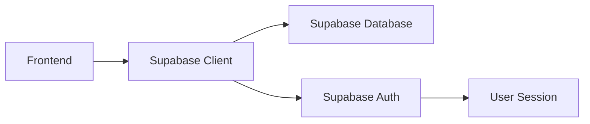
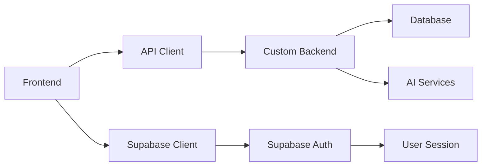

# API Integration Guide

## 🔌 Backend Connection Strategy

### Current State
The frontend is currently built with Supabase as the backend provider. For integration with a custom backend:

### Migration Path
1. **Maintain Supabase**: Keep for authentication and real-time features
2. **Add Custom API**: Integrate additional endpoints for business logic
3. **Gradual Migration**: Move features to custom backend as needed

## 📡 API Structure

### Expected Endpoints

#### Authentication
```typescript
POST /api/auth/login
POST /api/auth/logout  
POST /api/auth/refresh
GET  /api/auth/profile
```

#### Dashboard Data
```typescript
GET /api/dashboard/stats
GET /api/dashboard/alerts
GET /api/dashboard/activities
```

#### Threat Intelligence
```typescript
GET    /api/threats
POST   /api/threats
PUT    /api/threats/:id
DELETE /api/threats/:id
GET    /api/threats/analysis
```

#### Incidents Management
```typescript
GET    /api/incidents
POST   /api/incidents
PUT    /api/incidents/:id
DELETE /api/incidents/:id
PATCH  /api/incidents/:id/status
```

#### AI Assistant
```typescript
POST /api/ai/chat
GET  /api/ai/history
POST /api/ai/analyze
```

#### Reports
```typescript
GET  /api/reports
POST /api/reports/generate
GET  /api/reports/:id/download
```

## 🔧 Integration Implementation

### HTTP Client Setup
```typescript
// src/lib/api.ts
const API_BASE_URL = process.env.VITE_API_URL || 'http://localhost:3000/api';

class ApiClient {
  private baseURL: string;
  
  constructor(baseURL: string) {
    this.baseURL = baseURL;
  }
  
  async request<T>(endpoint: string, options: RequestInit = {}): Promise<T> {
    const url = `${this.baseURL}${endpoint}`;
    
    const response = await fetch(url, {
      headers: {
        'Content-Type': 'application/json',
        ...options.headers,
      },
      ...options,
    });
    
    if (!response.ok) {
      throw new Error(`API Error: ${response.status}`);
    }
    
    return response.json();
  }
}

export const apiClient = new ApiClient(API_BASE_URL);
```

### Authentication Integration
```typescript
// src/hooks/useApiAuth.ts
export const useApiAuth = () => {
  const { user, session } = useAuth();
  
  const apiRequest = async <T>(endpoint: string, options: RequestInit = {}): Promise<T> => {
    return apiClient.request(endpoint, {
      ...options,
      headers: {
        'Authorization': `Bearer ${session?.access_token}`,
        ...options.headers,
      },
    });
  };
  
  return { apiRequest, isAuthenticated: !!user };
};
```

## 📊 Data Flow Architecture

### Current Flow (Supabase)


### Target Flow (Hybrid)


## 🔄 Real-time Integration

### WebSocket Connection
```typescript
// src/lib/websocket.ts
export class WebSocketManager {
  private ws: WebSocket | null = null;
  private reconnectAttempts = 0;
  private maxReconnectAttempts = 5;
  
  connect(url: string, token: string) {
    this.ws = new WebSocket(`${url}?token=${token}`);
    
    this.ws.onmessage = (event) => {
      const data = JSON.parse(event.data);
      this.handleMessage(data);
    };
    
    this.ws.onclose = () => {
      this.handleReconnect();
    };
  }
  
  private handleMessage(data: any) {
    // Dispatch to appropriate handlers
    switch (data.type) {
      case 'threat_alert':
        // Handle threat alerts
        break;
      case 'incident_update':
        // Handle incident updates
        break;
    }
  }
}
```

## 🛡️ Security Considerations

### Token Management
- Store JWT tokens securely
- Implement token refresh logic
- Handle token expiration gracefully

### CORS Configuration
```javascript
// Backend CORS setup needed
const corsOptions = {
  origin: ['http://localhost:8080', 'https://your-domain.com'],
  credentials: true,
};
```

### Error Handling
```typescript
// src/lib/errorHandler.ts
export class ApiErrorHandler {
  static handle(error: any) {
    if (error.status === 401) {
      // Redirect to login
      window.location.href = '/auth';
    } else if (error.status === 403) {
      // Show unauthorized message
      toast.error('Access denied');
    } else {
      // Generic error handling
      toast.error('Something went wrong');
    }
  }
}
```

## 📋 Integration Checklist

- [ ] Set up API client with authentication
- [ ] Implement error handling and retry logic
- [ ] Add loading states for API calls
- [ ] Set up real-time connection management
- [ ] Configure environment variables
- [ ] Add API response type definitions
- [ ] Implement caching strategy
- [ ] Set up monitoring and logging
- [ ] Add offline support
- [ ] Test error scenarios

## 🔍 Testing Strategy

### API Mocking
```typescript
// src/mocks/apiMocks.ts
export const mockApiResponses = {
  '/api/dashboard/stats': {
    totalThreats: 1247,
    activeIncidents: 23,
    systemsOnline: 156,
    lastScanTime: new Date().toISOString(),
  },
};
```

### Integration Tests
- Test authentication flow
- Verify API error handling
- Check real-time connection stability
- Validate data synchronization