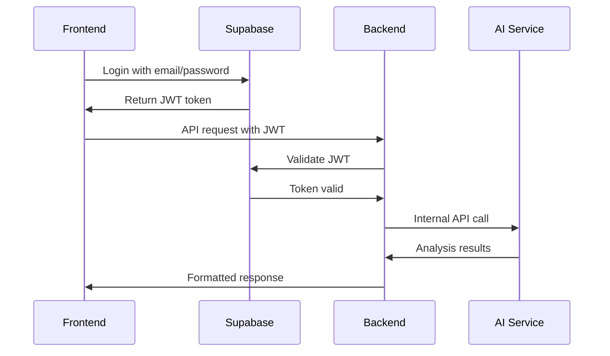
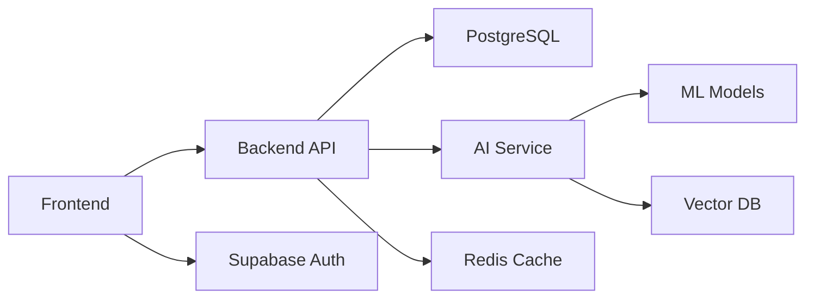

# API Integration Research & Planning

## 🔬 Current Integration Status

### Frontend-Only Phase (Current)
The platform currently operates as a frontend-only application using:
- **Supabase**: Authentication and database services
- **Mock Data**: Placeholder data for UI development
- **Static Assets**: Hardcoded content for demonstration

### Integration Roadmap

## 📡 Planned API Architecture

### Backend API Design (NestJS)
```typescript
// Planned API structure
interface ApiEndpoints {
  auth: {
    login: "POST /api/auth/login";
    logout: "POST /api/auth/logout";
    refresh: "POST /api/auth/refresh";
    profile: "GET /api/auth/profile";
  };
  
  dashboard: {
    stats: "GET /api/dashboard/stats";
    alerts: "GET /api/dashboard/alerts";
    activities: "GET /api/dashboard/activities";
  };
  
  search: {
    global: "GET /api/search?q={query}";
    threats: "GET /api/search/threats";
    incidents: "GET /api/search/incidents";
    vulnerabilities: "GET /api/search/vulnerabilities";
  };
  
  threats: {
    list: "GET /api/threats";
    create: "POST /api/threats";
    update: "PUT /api/threats/:id";
    delete: "DELETE /api/threats/:id";
  };
  
  incidents: {
    list: "GET /api/incidents";
    create: "POST /api/incidents";
    update: "PUT /api/incidents/:id";
    status: "PATCH /api/incidents/:id/status";
  };
}
```

### AI Service API Design (FastAPI)
```python
# Planned AI endpoints
endpoints = {
    "analysis": {
        "text": "POST /api/v1/analyze/text",
        "file": "POST /api/v1/analyze/file", 
        "network": "POST /api/v1/analyze/network",
        "code": "POST /api/v1/analyze/code"
    },
    
    "chat": {
        "message": "POST /api/v1/chat/message",
        "history": "GET /api/v1/chat/history",
        "context": "POST /api/v1/chat/context"
    },
    
    "models": {
        "list": "GET /api/v1/models",
        "status": "GET /api/v1/models/:id/status",
        "predict": "POST /api/v1/models/:id/predict"
    }
}
```

## 🔗 Integration Patterns

### Authentication Flow


### Data Flow Architecture


## 📊 Data Schema Planning

### User Profile Extension
```sql
-- Extended user profiles for cybersecurity context
CREATE TABLE user_profiles (
  id UUID PRIMARY KEY DEFAULT gen_random_uuid(),
  user_id UUID REFERENCES auth.users(id),
  role VARCHAR CHECK (role IN ('admin', 'analyst', 'viewer')),
  organization VARCHAR,
  security_clearance VARCHAR,
  preferences JSONB DEFAULT '{}',
  created_at TIMESTAMP DEFAULT NOW(),
  updated_at TIMESTAMP DEFAULT NOW()
);
```

### Security Entities
```sql
-- Threat intelligence data
CREATE TABLE threats (
  id UUID PRIMARY KEY DEFAULT gen_random_uuid(),
  name VARCHAR NOT NULL,
  description TEXT,
  severity VARCHAR CHECK (severity IN ('low', 'medium', 'high', 'critical')),
  type VARCHAR NOT NULL,
  indicators JSONB DEFAULT '[]',
  mitigation_steps TEXT,
  created_by UUID REFERENCES auth.users(id),
  created_at TIMESTAMP DEFAULT NOW(),
  updated_at TIMESTAMP DEFAULT NOW()
);

-- Security incidents
CREATE TABLE incidents (
  id UUID PRIMARY KEY DEFAULT gen_random_uuid(),
  title VARCHAR NOT NULL,
  description TEXT,
  status VARCHAR DEFAULT 'open' CHECK (status IN ('open', 'investigating', 'resolved', 'closed')),
  severity VARCHAR CHECK (severity IN ('low', 'medium', 'high', 'critical')),
  assigned_to UUID REFERENCES auth.users(id),
  threat_id UUID REFERENCES threats(id),
  metadata JSONB DEFAULT '{}',
  created_at TIMESTAMP DEFAULT NOW(),
  updated_at TIMESTAMP DEFAULT NOW()
);

-- Vulnerability assessments
CREATE TABLE vulnerabilities (
  id UUID PRIMARY KEY DEFAULT gen_random_uuid(),
  cve_id VARCHAR UNIQUE,
  title VARCHAR NOT NULL,
  description TEXT,
  cvss_score DECIMAL(3,1),
  severity VARCHAR,
  affected_systems TEXT[],
  patch_available BOOLEAN DEFAULT FALSE,
  created_at TIMESTAMP DEFAULT NOW(),
  updated_at TIMESTAMP DEFAULT NOW()
);
```

## 🛠️ Implementation Strategy

### Phase 1: Backend Foundation
1. **Set up NestJS project structure**
2. **Configure PostgreSQL with Prisma**
3. **Implement authentication bridge with Supabase**
4. **Create basic CRUD endpoints**
5. **Add input validation and error handling**

### Phase 2: AI Service Integration
1. **Set up FastAPI project**
2. **Implement basic text analysis endpoints**
3. **Add model serving infrastructure**
4. **Create chat interface API**
5. **Set up vector database for embeddings**

### Phase 3: Frontend Integration
1. **Replace mock data with API calls**
2. **Implement error handling and loading states**
3. **Add real-time updates via WebSockets**
4. **Optimize performance with caching**
5. **Add offline support capabilities**

## 🔒 Security Considerations

### API Security
- **Input Validation**: Sanitize all user inputs
- **Rate Limiting**: Prevent API abuse
- **CORS Configuration**: Restrict cross-origin requests
- **API Keys**: Secure service-to-service communication
- **Audit Logging**: Track all security-relevant actions

### Data Privacy
- **Encryption**: Encrypt sensitive data at rest and in transit
- **Access Control**: Role-based permissions
- **Data Retention**: Automated cleanup of old data
- **Anonymization**: Remove PII from logs and analytics

### Authentication & Authorization  
- **JWT Management**: Secure token handling and refresh
- **Session Management**: Proper session invalidation
- **Multi-Factor Authentication**: Optional 2FA support
- **OAuth Integration**: Support for enterprise SSO

## 📈 Performance Optimization

### Backend Optimization
- **Database Indexing**: Optimize query performance
- **Connection Pooling**: Efficient database connections
- **Caching Strategy**: Redis for frequently accessed data
- **Async Processing**: Background jobs for heavy operations

### API Optimization
- **Response Caching**: Cache static and semi-static data
- **Pagination**: Limit large result sets
- **Field Selection**: GraphQL-style field filtering
- **Compression**: Gzip response compression

### AI Service Optimization
- **Model Caching**: Cache model predictions
- **Batch Processing**: Process multiple requests together
- **GPU Utilization**: Optimize inference performance
- **Model Quantization**: Reduce model size and latency

## 🧪 Testing Strategy

### API Testing
```typescript
// Example API test structure
describe('Threats API', () => {
  it('should create a new threat', async () => {
    const threat = {
      name: 'Test Threat',
      severity: 'high',
      type: 'malware'
    };
    
    const response = await request(app)
      .post('/api/threats')
      .send(threat)
      .expect(201);
      
    expect(response.body.name).toBe(threat.name);
  });
});
```

### Integration Testing
- **End-to-End Tests**: Full user journey testing
- **API Contract Tests**: Ensure API compatibility
- **Database Integration**: Test database operations
- **External Service Mocks**: Mock third-party APIs

## 📋 Integration Checklist

### Backend API
- [ ] NestJS project setup and configuration
- [ ] PostgreSQL database schema implementation
- [ ] Prisma ORM integration and migrations
- [ ] Authentication middleware with Supabase
- [ ] CRUD endpoints for all entities
- [ ] Input validation and error handling
- [ ] API documentation with Swagger
- [ ] Unit and integration tests
- [ ] Docker containerization
- [ ] CI/CD pipeline setup

### AI Services
- [ ] FastAPI project structure
- [ ] ML model serving infrastructure
- [ ] Text analysis and threat detection
- [ ] Chat interface implementation
- [ ] Vector database integration
- [ ] Model monitoring and logging
- [ ] Performance optimization
- [ ] Docker containerization
- [ ] Model deployment pipeline

### Frontend Integration
- [ ] Replace mock data with API calls
- [ ] Implement loading and error states
- [ ] Add real-time updates
- [ ] Optimize API call patterns
- [ ] Add offline capabilities
- [ ] Performance monitoring
- [ ] Error tracking and reporting

This research document will guide the systematic integration of backend and AI services with the existing frontend platform.